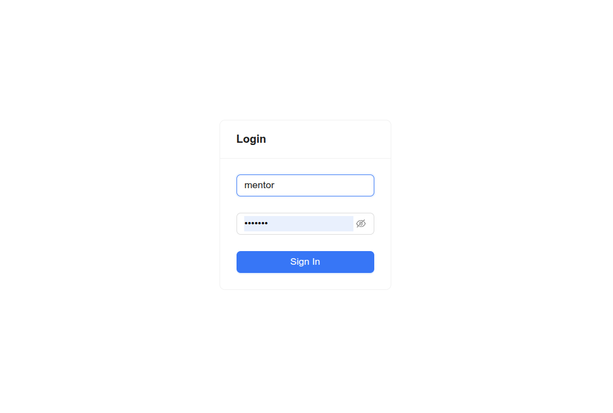
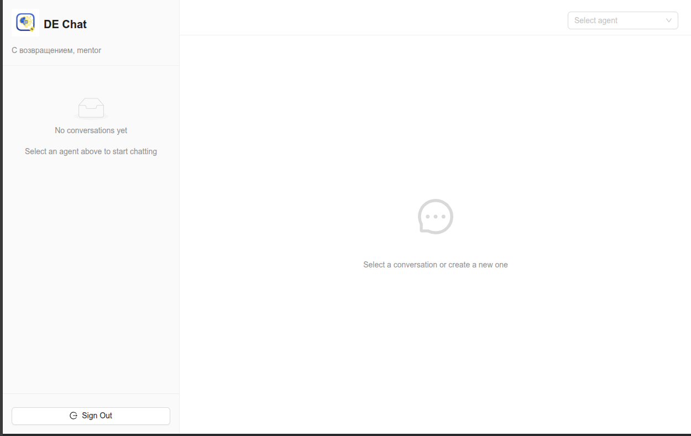
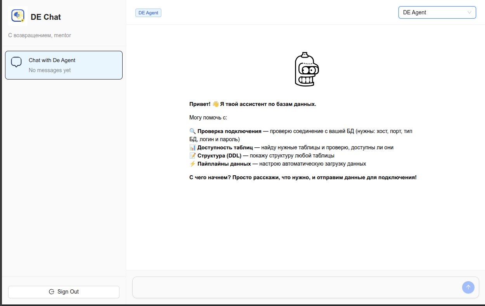
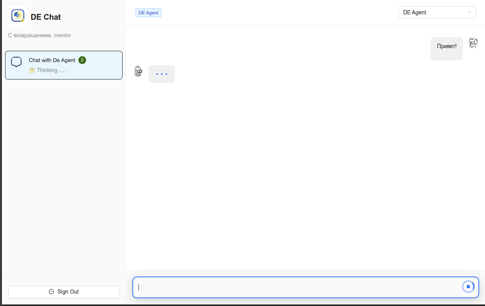
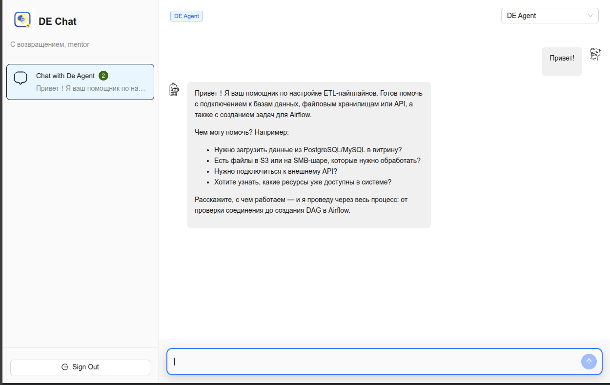

# LLM Chat frontend

Проект фронт части LLM чата для взаимодействия с ДЕ ассистентом.

## Первые шаги в использовании

Начало работы с LLM чатом начинается с авторизации. Мы реализовали LDAP авторизацию для приближения к реальным условиям работы для похожих приложений. Логин/пароль доступны в полной документации, загруженной на сайт хакатона.

Страница авторизации:

После авторизации мы попадаем в рабочую область LLM чата.

На данном этапе в правом верхнем углу необходимо выбрать агента, с которым мы хотим начать общение. В настоящий момент мы реализовали толь одного агента и выбор агента не влияет на его функциональность.

После выбора агента, нижней части страницы становится доступно поле ввода. Для отправки сообщения (как и в большинстве чатов) можно воспользоваться круглой кнопочкой или же воспользоваться комбинацией клавишь Ctrl+Enter.

Рекомендуем начать ваше общение с LLM Агентом с простого "Привет!". Агенту будет приятно, а у вас будет шанс спастись в войне против машин.

На наш вопрос LLM Агент отвечает с небольшой задержкой. 

Подробнее все доступные сценарии описаны в полной версии документации, загруженной на сайт хакатона.

## Архитектура агента

__Продублировано из репозитория Gitlab Агента__

Агент состоит из двух основных модулей:
- LLM Чат (пользовательский интерфейс)
- LLM Gitlab Агент (сервис)

Также, для работы сервисов необходим MCP сервер с набором инструметов для взаимодействия с базами данных и хранилищами.

Создание нового пайплайна для загрузки данных начинается в чате.
Пользователь в процессе общения с агентом передает все необходимые данные для создания новой загрузки данных.
Агент чата, после сбора необходимых данных, создает в приложении Gitlab issue, где собрана вся информация для создания пайплайна.
После создания issue Gitlab вызывает webhook к LLM Gitlab Агенту и запускает обработку issue. Gitlab Агент обрабатывает issue и создает в репозитории Gitlab в выделенном проекте новую ветку и передает в нее весь созданный код и документацию, создает Merge Request и завершает свою работу.

При принятии Merge Request'a срабатывает cicd по доставке изменений в Airflow.

Связанные проекты:

- MCP Сервер: https://github.com/AnatoliyAksenov/chat-app-mcp
- LLM Chat backend: https://github.com/AnatoliyAksenov/chat-app-backend
- LLM Chat frontend: https://github.com/AnatoliyAksenov/chat-app-frontend
- Gitlab Agent: https://github.com/AnatoliyAksenov/gitlab-agent

Также, мы подготовили развернутый стенд